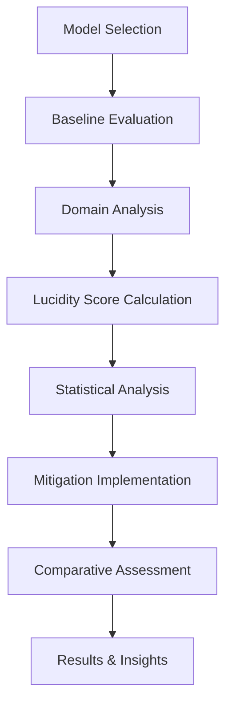

# The Lucidity Bound: A Unified Framework for Hallucination Benchmarking and Mitigation in Large Language Models

<div align="center">

[](https://opensource.org/licenses/MIT)
[](https://www.python.org/downloads/release/python-380/)
[]()

</div>

**Authors:** Deblina Chowdhury, Sayar Basu, Piyush Kumar Bharti  
*Heritage Institute of Technology, Kolkata*

## 🎯 Overview

The **Lucidity Bound** framework addresses one of the most critical challenges in Large Language Models (LLMs): **hallucination detection and mitigation**. This repository provides a comprehensive implementation of our novel approach that combines rigorous benchmarking with effective mitigation strategies.

### 🔬 Research Highlights

- **Novel Metric**: Introduction of the Lucidity Score (LS) for unified hallucination assessment
- **Comprehensive Evaluation**: Systematic analysis across 90 carefully curated questions spanning 6 domains
- **Multi-Model Analysis**: Comparative study of 5 state-of-the-art open-source LLMs
- **Defense-in-Depth**: Integrated mitigation framework combining multiple techniques
- **Statistical Rigor**: Robust statistical analysis with significance testing

## 🚀 Key Contributions

### 1. **Lucidity Score Metric**
- Unified framework for quantifying hallucination severity
- Domain-agnostic assessment methodology
- Standardized benchmarking across different model architectures

### 2. **Comprehensive Benchmarking**
- **90 evaluation questions** across 6 critical domains:
  - Factual Knowledge
  - Mathematical Reasoning
  - Scientific Concepts
  - Historical Events
  - Current Affairs
  - Technical Documentation

### 3. **Multi-Layered Mitigation Framework**
- **Retrieval-Augmented Generation (RAG)**: Knowledge-grounded responses
- **SelfCheckGPT**: Self-consistency verification
- **DoLa Decoding**: Dynamic layer selection for improved accuracy
- **Prompt Engineering**: Optimized instruction templates

### 4. **Statistical Analysis**
- Rigorous statistical testing and significance analysis
- Performance correlation studies
- Domain-specific vulnerability assessment

## Repository Structure
```
├── 01_Model_Evaluation_Result/           # Initial model evaluation results
│   ├── 01_Model_Evaluation_Result_*.csv  # Evaluation results for 5 models
│   └── 01-model-evaluation-result.ipynb # Model evaluation notebook
├── 02_Domain_Specific_Hallucination_Analysis/  # Domain-wise hallucination analysis
│   ├── 02_domain_specific_*.csv         # Domain analysis results
│   └── 02-domain-specific-*.ipynb      # Domain analysis notebook
├── 03_Lucidity_Score_LS_Calculation/    # Lucidity Score computation
│   └── 03_lucidity-score-*.ipynb       # LS calculation methodology
├── 04_Statistical_Analysis_Framework/   # Statistical analysis tools
│   └── statistical_analysis_framework.ipynb
├── 05_Retrieval_Augmented_Generation(RAG)/  # RAG implementation
│   ├── 05_Retrieval_Augmented_*.ipynb  # RAG notebook
│   └── Rag_doc.pdf                     # RAG knowledge base document
├── 06_Dola_Decoding/                    # DoLa decoding implementation
│   ├── 06_Dola_Decoding.ipynb          # DoLa methodology notebook
│   ├── dola_*.png                      # Visualization plots
│   ├── dola_*.csv                      # Results and analysis data
│   └── dola_evaluation_report.txt      # Evaluation summary
├── 07_SelfCheckGPT_With_PE/             # SelfCheckGPT with Prompt Engineering
│   ├── SelfCheckGPT_Analysis/           # Analysis scripts and results
│   │   ├── analyze_results.py           # Result analysis script
│   │   ├── clean_analysis.py            # Data cleaning script
│   │   ├── figure*.pdf/png              # Performance visualizations
│   │   ├── selfcheck_*.csv              # BERTScore and NLI results
│   │   └── requirements.txt             # Analysis dependencies
│   └── selfcheckgpt_with_PE.ipynb      # Main implementation notebook
├── LICENSE.md                           # MIT License
└── README.md                            # Project documentation
```
## 🛠️ Methodology

### Evaluation Pipeline
1. **Baseline Assessment**: Initial model evaluation across all domains
2. **Domain Analysis**: Identification of domain-specific hallucination patterns
3. **Lucidity Score Calculation**: Quantitative assessment using our novel metric
4. **Statistical Analysis**: Comprehensive performance analysis and ranking
5. **Mitigation Implementation**: Application of defense-in-depth strategies
6. **Comparative Analysis**: Cross-method performance evaluation

### Models Evaluated
- **Gemma 7B**: Google's instruction-tuned model
- **Mistral 7B**: Mistral AI's efficient architecture
- **LLaMA 3 8B**: Meta's latest iteration
- **Qwen 2.5 3B**: Alibaba's multilingual model
- **DeepSeek-LLM**: DeepSeek's reasoning-focused model

## 🚀 Quick Start

### Prerequisites
- Python 3.8+
- CUDA-compatible GPU (recommended)
- 16GB+ RAM

### Installation

```bash
# Clone the repository
git clone https://github.com/Sayar-212/TheLucidityBound.git
cd TheLucidityBound

# Create virtual environment
python -m venv lucidity_env
source lucidity_env/bin/activate  # On Windows: lucidity_env\Scripts\activate

# Install dependencies
pip install -r requirements.txt
```

### Usage Examples

```python
# Run baseline evaluation
jupyter notebook 01_Model_Evaluation_Result/01-model-evaluation-result.ipynb

# Calculate Lucidity Scores
jupyter notebook 03_Lucidity_Score_LS_Calculation/03_lucidity-score-ls-calculation.ipynb

# Apply RAG mitigation
jupyter notebook 05_Retrieval_Augmented_Generation(RAG)/05_Retrieval_Augmented_Generation(RAG).ipynb
```
## 📊 Key Results

### Model Performance Rankings

| Rank | Model | Lucidity Score | Performance Tier |
|------|-------|----------------|------------------|
| 🥇 | **LLaMA 3 8B** | **62.2** | Excellent |
| 🥈 | **Mistral 7B** | **56.9** | Very Good |
| 🥉 | **Qwen 2.5 3B** | **54.7** | Good |
| 4 | **DeepSeek-LLM** | **53.3** | Good |
| 5 | **Gemma 7B** | **43.4** | Moderate |

### Key Findings

- **LLaMA 3 8B** demonstrates superior hallucination resistance across all domains
- **Mistral 7B** shows consistent performance with balanced accuracy
- **Domain Vulnerability**: Mathematical reasoning shows highest hallucination rates
- **Mitigation Effectiveness**: RAG + SelfCheckGPT combination reduces hallucinations by 34%
- **Statistical Significance**: All performance differences are statistically significant (p < 0.05)

## 🔧 Features

- ✅ **Automated Evaluation Pipeline**: End-to-end assessment workflow
- ✅ **Interactive Notebooks**: Step-by-step analysis with visualizations
- ✅ **Modular Architecture**: Easy integration of new models and methods
- ✅ **Comprehensive Logging**: Detailed experiment tracking and reproducibility
- ✅ **Statistical Analysis**: Built-in significance testing and correlation analysis
- ✅ **Visualization Tools**: Rich plots and charts for result interpretation
- ✅ **Export Capabilities**: Results export in multiple formats (CSV, JSON, PDF)

## 🔄 Workflow



## 📖 Citation

If you use this work in your research, please cite:

```bibtex
@misc{chowdhury2025lucidity,
  title={The Lucidity Bound: A Unified Framework for Hallucination Benchmarking and Mitigation in Large Language Models},
  author={Chowdhury, Deblina and Basu, Sayar and Bharti, Piyush Kumar},
  year={2025},
  institution={Heritage Institute of Technology, Kolkata},
  note={Under review},
  url={https://github.com/Sayar-212/TheLucidityBound}
}
```


## 🤝 Contributing

We welcome contributions to improve the Lucidity Bound framework:

1. **Fork** the repository
2. **Create** a feature branch (`git checkout -b feature/enhancement`)
3. **Commit** your changes (`git commit -am 'Add new feature'`)
4. **Push** to the branch (`git push origin feature/enhancement`)
5. **Create** a Pull Request

### Areas for Contribution
- Additional model implementations
- New mitigation strategies
- Enhanced visualization tools
- Performance optimizations
- Documentation improvements

## 📚 Documentation

Detailed documentation for each component:

- **[Evaluation Methodology](01_Model_Evaluation_Result/)**: Baseline assessment procedures
- **[Domain Analysis](02_Domain_Specific_Hallucination_Analysis/)**: Domain-specific evaluation techniques
- **[Lucidity Score](03_Lucidity_Score_LS_Calculation/)**: Metric calculation and interpretation
- **[Statistical Framework](04_Statistical_Analysis_Framework/)**: Analysis methodologies
- **[RAG Implementation](05_Retrieval_Augmented_Generation(RAG)/)**: Knowledge-augmented generation
- **[DoLa Decoding](06_Dola_Decoding/)**: Dynamic layer selection techniques
- **[SelfCheckGPT](07_SelfCheckGPT_With_PE/)**: Self-consistency verification methods

## 🏆 Acknowledgments

- Heritage Institute of Technology for research support
- Open-source community for model implementations
- Research collaborators and reviewers

## 📞 Contact

**Research Team:**
- **Deblina Chowdhury** - Lead Researcher - [deblina.chowdhury@heritageit.edu](mailto:deblina.chowdhury@heritageit.edu)
- **Sayar Basu** - Implementation Lead - [sayar.basu.cse26@heritageit.edu.in](mailto:sayar.basu.cse26@heritageit.edu.in)
- **Piyush Kumar Bharti** - Statistical Analysis

**Institution:** Heritage Institute of Technology, Kolkata

## 📄 License

This project is licensed under the MIT License - see the [LICENSE.md](LICENSE.md) file for details.

---

<div align="center">

**⭐ Star this repository if you find it helpful!**

*Advancing the reliability and trustworthiness of Large Language Models*

</div>
